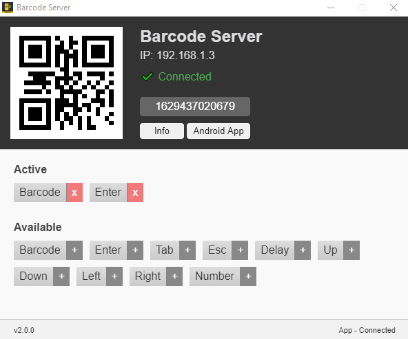
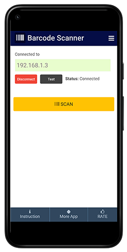

# Barcode Server
A barcode server for Barcode Client Server android app.

You can use it for
- Customize Software
- MS Excel
- Google Spreadsheet
- MS Word
- Any PC software for input barcode data.

Watch: [Video Tutorial](https://www.youtube.com/watch?v=0b8YFzFiS28)

Server App (v2.0.0)            |  Mobile App
:-------------------------:|:-------------------------:
[Download](https://github.com/haruncpi/barcode-server/releases/download/v2.0.0/BarcodeServer-2.0.0.zip)| [Download from PlayStore](https://play.google.com/store/apps/details?id=com.learn24bd.barcode)
 |  

### Command Snippet

Program            |  Use command |  Comment
:------------------:|:------------:|:----------
Google Spreadsheet | `Barcode Delay:100ms Enter` |
MS Excel | `Barcode Enter` |

